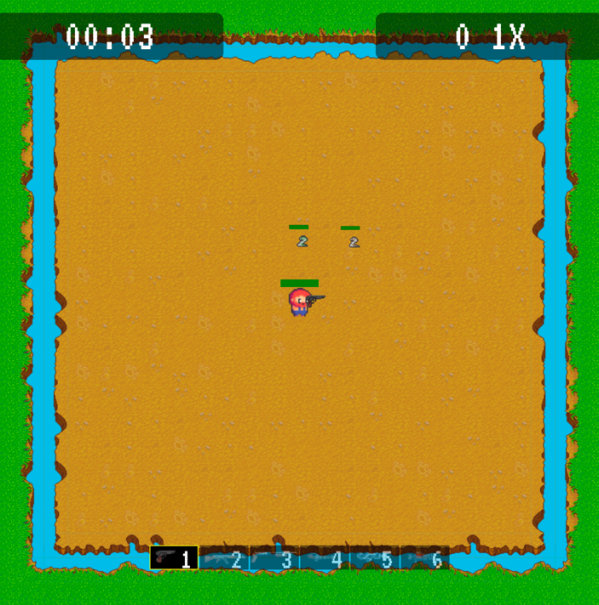

# The Farmer and The Viper

2D shooting game inspired by our childhood 2D shooting game combined with The Farmer and the Snake Moral Story
For the Prog Meth course term project

## Game Overview

The Farmer’s farm is invaded by large herds of vipers. Instead of allowing the vipers to live in his field
as they please. Instead, the farmer chose to fight for their honor and dignity. and want to destroy the
myth that at the end of The Farmer and The Viper story must end by the farmer is bitten by the viper.

# How to play

- **W:** Move forward.
- **A:** Move left.
- **S:** Move backward.
- **D:** Move right.
- **1-6:** Pick/Swap Weapons
  - **1:** Pistol (available from start)
  - **2:** Rifle (available after 1 minute)
  - **3:** Shotgun (available after 1 minute)
  - **4:** Machinegun (available after 3 minutes)
  - **5:** Laser Gun (available after 3 minutes)
  - **6:** Flamethrower (available after 3 minutes)

## Gameplay

- **Player:** Starts with 100 HP, can use various guns.
- **Floor:** Area for player and viper movement.
- **Enemy:**
  - _Vipers:_ 50 HP, spawn at start. Increase in number every 20 sec before 5 minutes.
  - _King Viper:_ 10000 HP, summoned at 5 minutes. Slower, deals 90 damage.
- **Weapons:**
  - _Pistol:_ 20 damage, 3.33 shots/sec (available from start).
  - _Rifle:_ 25 damage, 3.33 shots/sec (available after 1 minute).
  - _Shotgun:_ 20 damage/bullet, 2 shots/sec, 3 bullets/spray (available after 1 minute).
  - _Machinegun:_ 5 damage, 15 shots/sec (available after 3 minutes).
  - _Laser Gun:_ 40 damage, 1.25 shots/sec, penetrates enemies (available after 3 minutes).
  - _Flamethrower:_ 2 damage, 6.66 shots/sec, continuous damage (available after 3 minutes).
- **Gun Inventory:** Displays available guns with transparency based on usability.
- **Timer:** Shows time since game start.
- **Score:** Starts at 0, increases by 10 for killing vipers (2000 for King Viper). Multiplier increases for every 10 kills without damage, max 20x. Reset if player takes damage.

## Game Flow

- Start: Player, 3 vipers spawn.
- 1 min: Shotgun and rifle available.
- 3 min: All guns available.
- 5 min: King Viper summoned, no more viper increase.
- King Viper Death: Vipers stop respawning. Player wins if all vipers, including King Viper, are killed. Game over if player's HP reaches 0.

## Game preview

1. Starting menu

2. Playing screen

3. Lose screen

4. Won screen

## Video Presentation

Our video presentation:
[The Farmer and The Viper Gameplay](https://www.youtube.com/watch?v=n6ouBzrp_s8)
